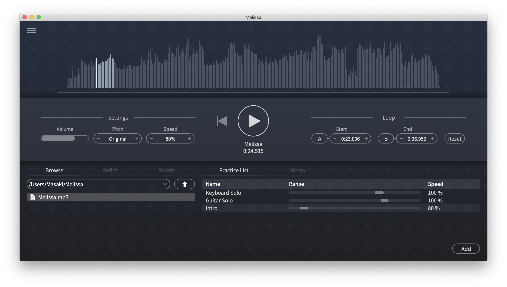

Now preparing for release...

---

<div align="center"><image src="Images/logo.png"></div>

<h1 align="center">A music player for musical instrument practice<br>for macOS and Windows</h1>



## Latest releases
- Coming soon

## How to build
1. Get [Projucer](https://juce.com/discover/projucer).
2. Install submodules
```
git submodule update --init
```
3. Open [Melissa/Melissa.jucer](Melissa/Melissa.jucer) with Projucer
4. Create and open a Xcode project file or Visual Studio solution on Projucer

## License
[LGPL-2.1 (c) 2020 Masaki Ono](LICENSE)

