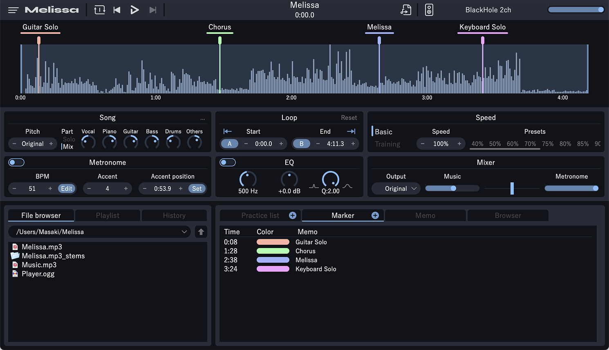

<h1 align="center">A music player for musical instrument practice<br>for macOS and Windows</h1>




<div align="center"> Official site
<a href="https://mosynthkey.github.io/Melissa/index_en.html">English</a>/
<a href="https://mosynthkey.github.io/Melissa/index.html">日本語</a></div>

## Downloads
### macOS
- [Version 3.0.0](https://github.com/mosynthkey/Melissa/releases/download/v3.0.0/Melissa_3_0_0.dmg)

### Windows
- [Version 3.0.0 (64bit)](https://github.com/mosynthkey/Melissa/releases/download/v3.0.0/Melissa_3.0.0_64.zip)

## Manual
- [English](https://github.com/mosynthkey/Melissa/wiki/Manual-(English))
- [日本語](https://github.com/mosynthkey/Melissa/wiki/Manual-(Japanese))

## How to build
1. Get [Projucer](https://juce.com/discover/projucer).
2. Download and extract libtensorflow 2.8.0 to [ThirdParty](ThirdParty)
- [macOS](https://drive.google.com/file/d/1RoUstBT632f8aIB4R3E0IlsGUU6H3IvA/view?usp=share_link)
- [Windows](https://storage.googleapis.com/tensorflow/libtensorflow/libtensorflow%2Dcpu%2Dwindows%2Dx86_64%2D2.8.0.zip)
3. Install submodules
```
git submodule update --init
```
4. Open [Melissa/Melissa.jucer](Melissa/Melissa.jucer) with Projucer
5. Create and open a Xcode project file or Visual Studio solution on Projucer

To build on Windows, please get ASIO driver or disable ASIO from Projucer.
See [this](ThirdParty/asio/how%20to%20get%20asio%20sdk.md) for the detail.

## Contact
[Twitter](https://twitter.com/Melissa__Player)

## Libraries
- [JUCE](https://juce.com) 
- [SoundTouch](https://www.surina.net/soundtouch/)
- [spleeterpp](https://github.com/gvne/spleeterpp)
- [speet](https://github.com/gvne/spleet)
- [nlohmann/json](https://github.com/nlohmann/json)
- [TensorFlow for C](https://www.tensorflow.org/install/)　
- [Eigen](https://eigen.tuxfamily.org/index.php?title=Main_Page)

## License
[LGPL-2.1 (c) 2022 Masaki Ono](LICENSE)
